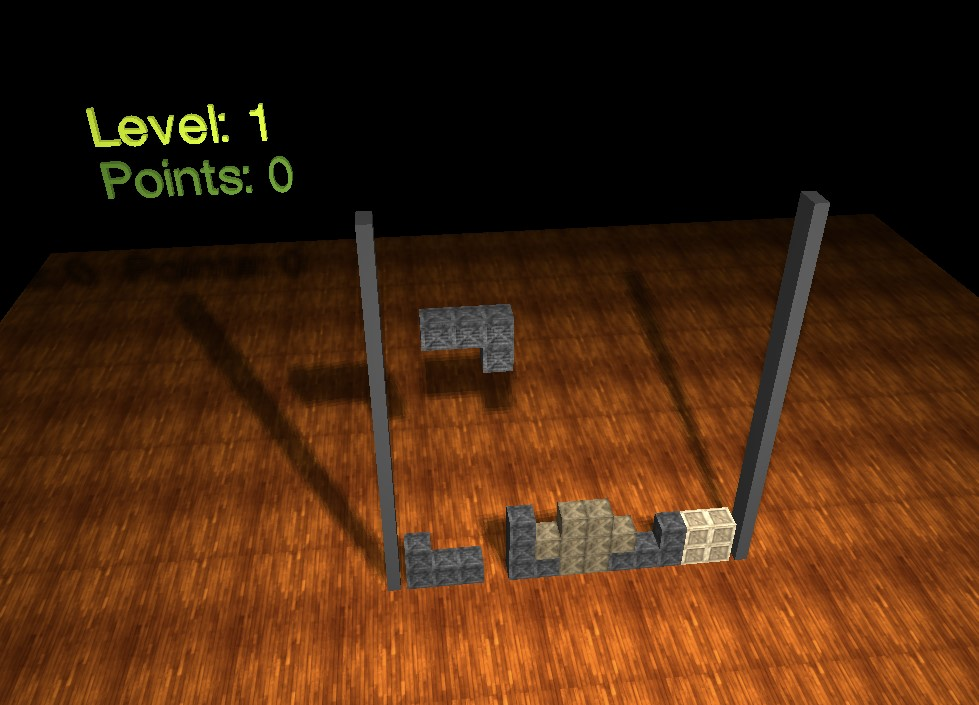

# three-dee-tris
a 3d building block game written in three.js 

This as a project I did several years ago (around 2015) to learn and dig into Web GL with three.js. 

This is no commercial project, just for learning purpose.

For now I just uploaded it "as is", will refactor this in the future and update to new versions and a modern build system.



## Note

there is no menu or something yet, you will see a blank floor rotating. Hit "Esc" to start playing, reload page to start fresh.

## get started

install and start docker for desktop 

run 

```
docker-compose up -d
```

go to http://localhost/ and drop tiles until your eyes roll out
